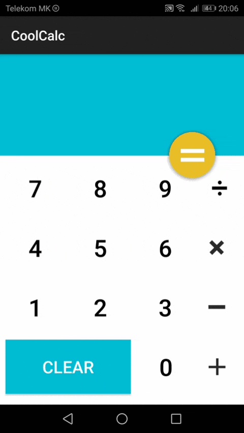

# Android_Calculator
Cool-Calc

## Description

  ### 1. Mathematical Operations:
  - Plus 		    ( + )
  - Minus		    ( - )
  - Division 	  ( / )
  - Multiplier 	( * )
 
      
  ### 2. Create:                          

   **Class:**
   - MainActivity.class   
   
  **layout:**
   - activity_main.xml
 

### 3.Demo:

## Author: Nikola Petkovik
  ### contact:
   - Gmail: nikolapetkovik86@gmail.com
